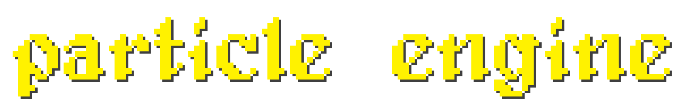

<!-- 

 -->

# [<b>>> Download Dev Build</b>](https://github.com/o7q/particle-engine/raw/main/assets/build/particle_engine.exe)
**particle engine** is an experimental particle world simulator written in C# that runs in a WinForms environment. \
Think [**Powder Game**](https://dan-ball.jp/en/javagame/dust) but worse.

**I plan a rewrite in C++ soon.**

---

